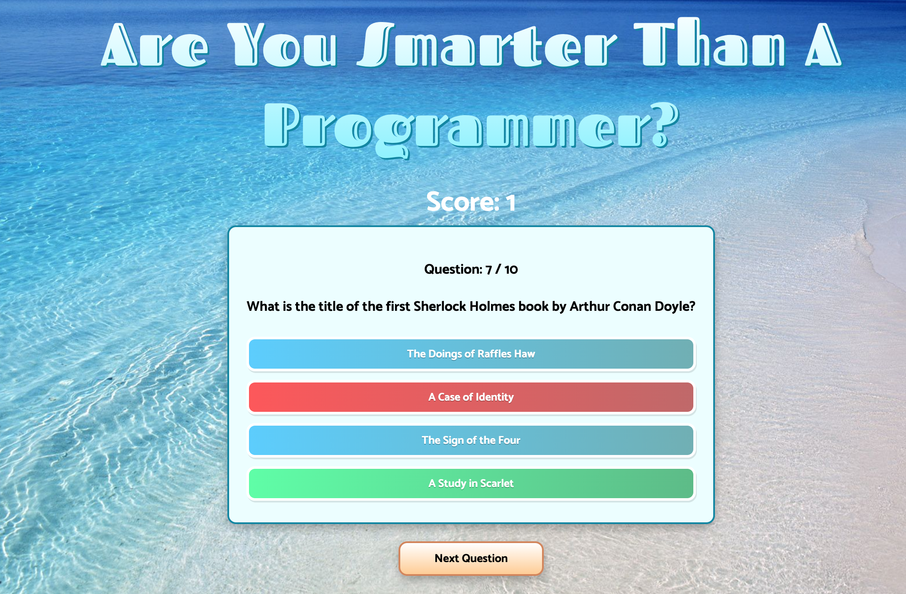

<h1 align="center">React Quiz </h1>


  
<br />
## Description
🔍 Fun and Interactive quiz written in TypeScript, and utilizes react to manipulate the DOM, also implemented an Open Source API to retrieve the quiz questions asked.
Click [Here](https://ibarrasb-react-quiz.netlify.app) to launch App!
## Table of Contents
- [Description](#description)
- [License](#license)
- [Installation](#Installation)
- [Contributing](#contributing)
- [Tests](#Tests)
## Installation
```
npm i react react-dom
```

## Usage

```
npm start
```

## Tests

## License

<br />
This application is covered by the MIT license. 
## Contributing
Eddie Ibarra
<br />
:octocat: Find me on GitHub: [ibarrasb](https://github.com/ibarrasb)<br />
<br />
✉Email me with any questions: eddieibarra43@gmail.com<br /><br />